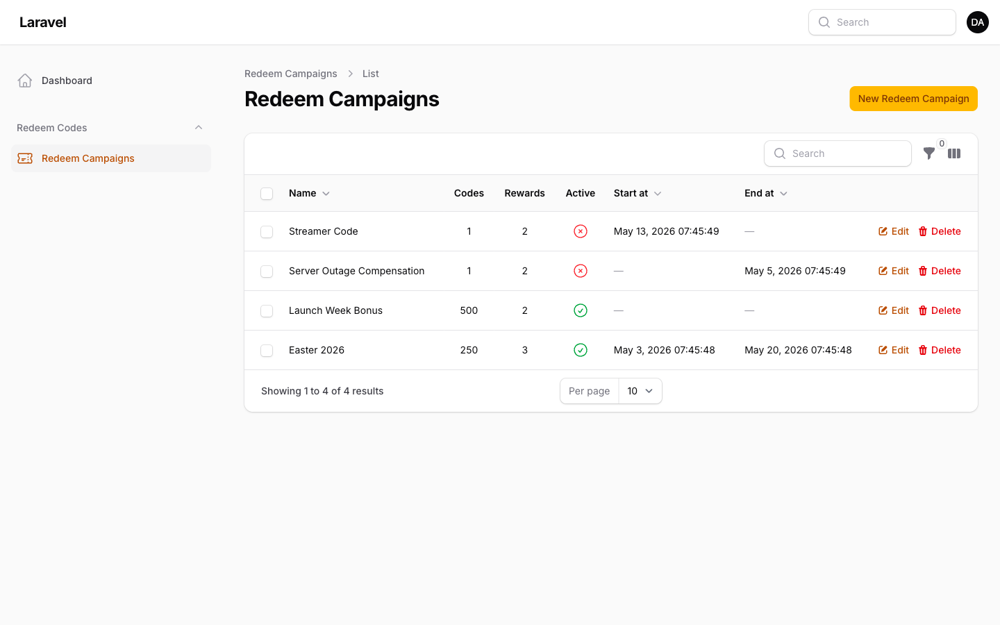
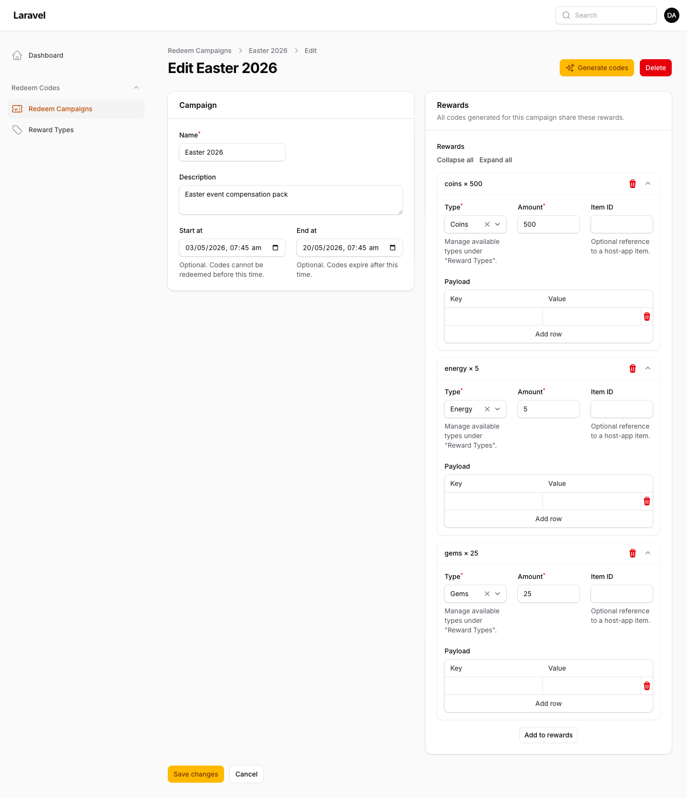
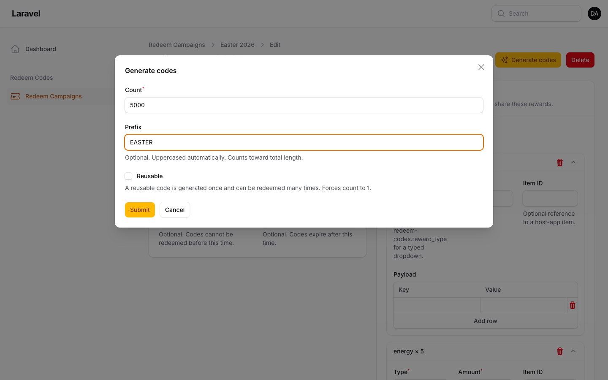
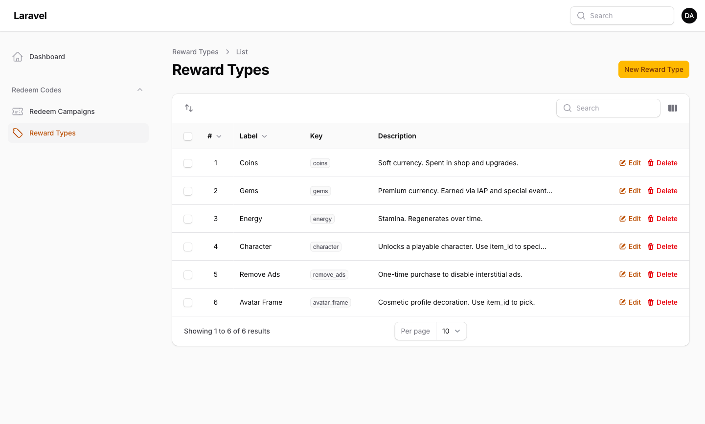
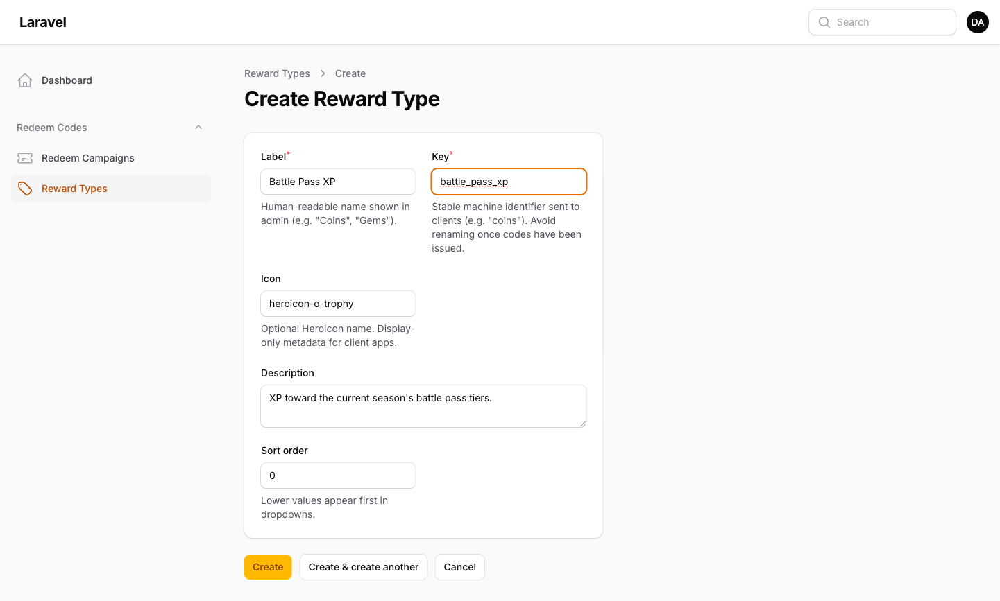

# Filament Redeem Codes

A Filament v5 plugin for **batch-issued, multi-reward redeem codes** — built for game player compensation, event rewards, and marketing campaigns where one batch needs to issue many codes that all share the same reward set.

This is a ground-up rewrite of [`furic/redeem-codes`](https://github.com/furic/laravel-redeem-codes), a 2018 package retired in favour of a Filament-native approach.

## Screenshots

| Campaign list | Edit campaign + rewards | Generate codes |
|---|---|---|
|  |  |  |

| Reward types (admin-managed) | Add a new reward type |
|---|---|
|  |  |

## Why this plugin

Existing Filament coupon/voucher plugins target e-commerce: one code, one discount value. None of them model the "campaign → N codes → M shared rewards" topology that games need (e.g. an Easter event hands out 5,000 codes that all grant 500 coins + 1 character + 5 energy).

| Need | Existing Filament plugins | This plugin |
|---|---|---|
| Generate N codes at once | ❌ | ✅ |
| Multi-reward per code | ❌ (1 discount only) | ✅ (any number of typed rewards) |
| Campaign / batch grouping | ❌ | ✅ |
| Game-style rewards (items, currency) | ❌ (monetary only) | ✅ (enum or admin-managed) |
| Print/OCR-friendly code alphabet | — | ✅ (no `0/1/O/I` ambiguity) |
| Public redemption API + rate limit | — | ✅ |

## Requirements

- PHP `^8.2`
- Laravel `^11.0 || ^12.0 || ^13.0`
- Filament `^5.0`

## Install

```bash
composer require furic/filament-redeem-codes
php artisan vendor:publish --tag="filament-redeem-codes-migrations"
php artisan vendor:publish --tag="filament-redeem-codes-config"
php artisan migrate
```

Register the plugin in your panel provider:

```php
use Furic\FilamentRedeemCodes\FilamentRedeemCodesPlugin;

public function panel(Panel $panel): Panel
{
    return $panel
        ->id('admin')
        ->plugins([
            FilamentRedeemCodesPlugin::make(),
        ]);
}
```

## Reward types — pick a binding strategy

Reward types are stored as strings on each reward row. The `filament-redeem-codes.reward_type` config decides how those strings are constrained and presented in the panel. Two flavours are supported:

### Option A: Backed enum (recommended for single-game, code-controlled types)

Define a backed enum implementing the marker interface and bind it:

```php
// app/Enums/RewardType.php
namespace App\Enums;

use Furic\FilamentRedeemCodes\Contracts\RewardType as RewardTypeContract;

enum RewardType: string implements RewardTypeContract
{
    case Coins = 'coins';
    case Gems = 'gems';
    case Energy = 'energy';
    case Character = 'character';
    case RemoveAds = 'remove_ads';
}
```

```php
// config/filament-redeem-codes.php
'reward_type' => App\Enums\RewardType::class,
```

The campaign form switches from a free-text input to a typed `Select`, and `RedeemCodeReward::$type` hydrates as your enum so you get exhaustive `match` checks in host code.

**Use when:** the reward set is closed and tied to compiled client logic. Adding a new type requires deploying client code anyway, so source-controlling the list makes sense.

### Option B: Eloquent model (admin-managed, runtime-editable)

Bind the bundled model — a `Reward Types` page appears in the panel where ops/marketing can add, rename, and reorder types without a deploy:

```php
// config/filament-redeem-codes.php
'reward_type' => Furic\FilamentRedeemCodes\Models\RedeemRewardType::class,
```

Each row carries `key` (machine identifier sent to clients), `label` (human name), `icon`, `description`, and `sort_order`. The campaign form populates the Type dropdown from these rows. The redemption API includes the resolved label alongside the raw type string:

```json
{"type": "coins", "label": "Coins", "amount": 500}
```

**Use when:** multi-game/white-label panels, marketing-driven cosmetic rewards (avatar frames, sticker packs), or i18n labels — anywhere the *type list itself* benefits from non-developer curation. **Tradeoff:** you lose compile-time safety in host code.

### Option C: Free-text (default, no binding)

Leave `reward_type` as `null`. Campaign form uses a plain text input, types are stored verbatim. Fine for prototypes and low-stakes uses.

## Generating codes

In the panel, open a campaign's edit page and click **Generate codes** in the header. Provide a count, optional prefix, and optional `reusable` flag.

Programmatically:

```php
use Furic\FilamentRedeemCodes\Actions\GenerateCodes;
use Furic\FilamentRedeemCodes\Models\RedeemCampaign;

$campaign = RedeemCampaign::create(['name' => 'Easter 2026']);
$campaign->rewards()->createMany([
    ['type' => 'coins', 'amount' => 500],
    ['type' => 'energy', 'amount' => 5],
]);

$codes = (new GenerateCodes)->execute(
    campaign: $campaign,
    count: 5_000,
    prefix: 'EASTER',
    reusable: false,
);
```

## Public redemption API

```
GET /api/redeem/{code}
```

**Success (200):**
```json
{
  "data": {
    "code": "EASTERAB23GH",
    "reusable": false,
    "redeemed_at": "2026-05-06T12:34:56+00:00",
    "rewards": [
      {"type": "coins", "label": "Coins", "amount": 500},
      {"type": "energy", "label": "Energy", "amount": 5}
    ]
  }
}
```

The `label` field is included only when a reward type binding is configured (enum case name, or model `label` column). With no binding, only `type` is returned.

**Failure responses:**

| Status | `error` | Meaning |
|---|---|---|
| 404 | `code_not_found` | Unknown code |
| 409 | `code_already_redeemed` | Single-use code already consumed |
| 422 | `campaign_not_started` | Campaign `start_at` is in the future |
| 410 | `campaign_expired` | Campaign `end_at` is in the past |
| 429 | (Laravel default) | Rate limit hit |

The endpoint is rate-limited to **10 attempts per minute per IP** by default. Configure via `filament-redeem-codes.api.rate_limit` (`"<attempts>,<minutes>"`).

To disable the API entirely (panel-only usage):

```php
'api' => ['enabled' => false],
```

## Events

`Furic\FilamentRedeemCodes\Events\RedeemCodeRedeemed` fires after a successful redemption. Hook it to grant rewards in your host app:

```php
use Furic\FilamentRedeemCodes\Events\RedeemCodeRedeemed;

Event::listen(RedeemCodeRedeemed::class, function (RedeemCodeRedeemed $event) {
    foreach ($event->code->rewards as $reward) {
        // grant $reward->type / $reward->amount to auth()->user()
    }
});
```

## Per-user redemption tracking

By design, this package does **not** know who redeemed what. **Single-use** codes self-track via `redeemed_at`; **reusable** codes never become unredeemable. If you need per-user "this user has already used this reusable code" enforcement, listen for `RedeemCodeRedeemed` and store that linkage in your host app.

## Migrating from `furic/redeem-codes`

The schema is intentionally different — this is a v2, not a drop-in upgrade. Notable changes:

- `events` → `redeem_campaigns` (also fixes the `start_at`/`started_at` inconsistency in v1)
- `redeemed` boolean → `redeemed_at` nullable timestamp
- `redeem_code_rewards.type` was numeric → now string (host binds an enum)
- Hardcoded reward types removed; bind your own enum
- Web console replaced by Filament Resource
- Built-in rate limiting and structured error codes
- Real test suite

Existing v1 installations should write a one-time data migration; the schemas don't line up.

## Testing

```bash
composer install
composer test
```

## License

MIT — see [LICENSE](LICENSE).
